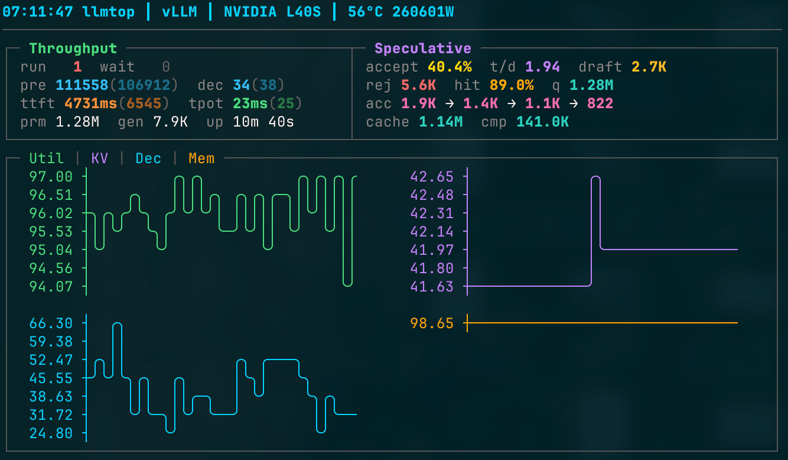

# llmtop

Real-time terminal dashboard for LLM inference servers. Monitor GPU utilization, throughput, speculative decoding, prefix cache, and timeline charts — all in your terminal.



## Installation

```bash
curl -sfL https://raw.githubusercontent.com/y9c/llmtop/main/install.sh | sh
```

Or build from source:

```bash
git clone https://github.com/y9c/llmtop.git
cd llmtop && make build
```

## Usage

```bash
llmtop                          # Connect to localhost:8000 (default)
llmtop --port 8080              # Different port
llmtop --host 192.168.1.100     # Remote host
llmtop --rate 500ms             # Faster updates
llmtop --gpu 0                  # Monitor specific GPU
llmtop --url http://ollama:11434/api/ps  # Custom metrics URL
```

| Flag | Default | Description |
|------|---------|-------------|
| `--url` | `""` | Full metrics URL (overrides host/port) |
| `--host` | `localhost` | Metrics host |
| `--port` | `8000` | Metrics port |
| `--backend` | `auto` | Force backend (`vllm`, `sglang`, `ollama`, `llamacpp`) |
| `--rate` | `1s` | Update interval |
| `--gpu` | `-1` (all) | GPU ID (0-based) |

`q` or `Ctrl+C` to quit.

> **llama.cpp users**: Pass `--metrics 1` to `llama-server` to enable the `/metrics` endpoint.

## Backends

| Backend | Status |
|---------|--------|
| **vLLM** | Full metrics (inc. speculative decoding, prefix cache) |
| **SGLang** | Full metrics |
| **llama.cpp** | Full metrics (inc. speculative decoding) |
| **Ollama** | VRAM usage via `/api/ps` |

## Features

- GPU temperature (°C) and power draw (W) in footer
- Session-wide min/avg/max TTFT and TPOT latency tracking
- Speculative decoding acceptance rate per position
- Prefix cache hit rate tracking
- Nightly builds on every push to main
- Custom metrics URL via `--url` flag

## License

MIT
